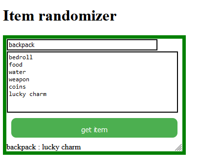

# item-randomizer
GOAL:  fully customizable virtual game master screen.
CURRENT: Insert your items here (each item in a new line) and a random get one.

Future features:
  - ignoring empty new lines
  - roll-ability of multiple tables

User case:

1. fill the bigger textbox with items, each in new line:  

bedroll 
food
water
weapon
coins
lucky charm

 

2. click on get item
    
