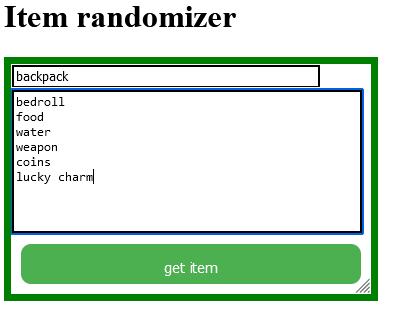

# item-randomizer
GOAL:  fully customizable virtual game master screen.  

## Features:
- Fill the table with entries and click on get item to roll for a random entry.
- Multiple tables are available
- Roll-ability of multiple tables: nest roll up to 20 tables
- Ignoring empty new lines, added warning for rolling empty table

## FUTURE FEATURES:
  - drag and drop tables

## **HOW TO USE?**

### Basic use
  0. Visit the site  https://item-randomizer--gajaguerrini.repl.co
  1. Give the table a name _backpack_ 
  2. Fill the bigger textbox with items, each in new line  _bedroll 
food
water
weapon
coins
lucky charm_ 
  3. click on get item  
 
  4. Click on the button with "+" to get more tables  
  5. Get one more table   
  6. Fill it out like described in step 1 and 2. Enjoy rolling your items by clicking get item.   

### Nesting multiple tables:

This tool lets you roll multiple tables with one click. You can roll up to 20 tables. 
  1. Give the table a name _random encounter_  
  2. Fill the bigger textbox with items, each in new line _monsters
merchant
bandits
fortune teller_   
  3. Create a new table by clicking on "+" button.
  4. To roll multiple tables the table name needs to match an item in the item list. Check your spelling! This feature will not work if you dont ***use the same word***.   
  Click on get item. If the result of _random encounter_ is  _monsters_ the _monsters_ table will automatically be rolled.   
  

Code available at https://github.com/GajaGuerrini/item-randomizer.